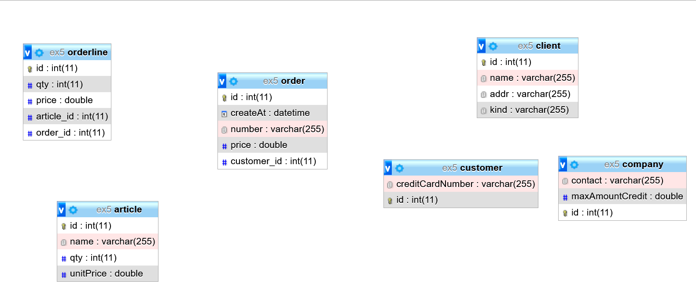
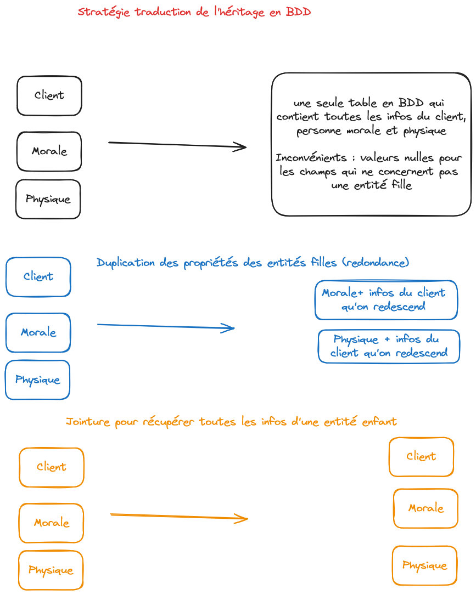

# Correction exercice 5

---

## Pour exécuter la correction

1. Créez une base de donnée (BDD) via `PHPMYADMIN` par exemple
2. Modifiez les informations d'accès à votre BDD, attention au PORT (chez moi c'est `3308`, chez vous "normalement" c'est `3306`)
3. Exécutez à la racine du projet `composer install` pour régénérer le dossier `vendor`
4. Exécutez le script : `composer run c` (script présent dans la partie `scripts` du `composer.json` qui à son tour exécutera `php bin/doctrine orm:schema-tool:create`)

---

## Ressources sur Doctrine

## Ressources

- [Les types Doctrine](https://www.doctrine-project.org/projects/doctrine-dbal/en/4.0/reference/types.html)
- [Les annotations Doctrine](https://www.doctrine-project.org/projects/doctrine-orm/en/2.7/reference/annotations-reference.html)
- [Annotations pour les relations entre les tables](https://www.doctrine-project.org/projects/doctrine-orm/en/3.1/reference/association-mapping.html)
- [Gestion de l'héritage, documentation à lire, arrêtez-vous avant le chapitre sur les Overrides](https://www.doctrine-project.org/projects/doctrine-orm/en/3.1/reference/inheritance-mapping.html)

---

## Schéma relationnel

## Stratégies héritage en BDD

