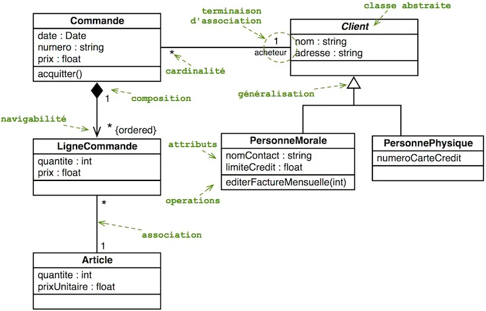

# Exercice 1 : POO

1. Implémentez le diagramme de classes ci-après en POO avec PHP.
2. Implémentez un ou plusieurs scénarios de cas d'utilisation en instanciant des objets par exemple :
- *Un client effectue une commande contenant plusieurs articles*
- Etc.

**PS : vous avez le droit d'ajouter des nouvelles propriétés et/ou méthodes aux classes pour effectuer les scénarios précédents ou selon la pertinence (tout en restant proche des besoins)**
 
[Source diagramme de classe manurmx](https://medium.com/@manurnx/le-diagramme-de-classes-2447602613f2)

