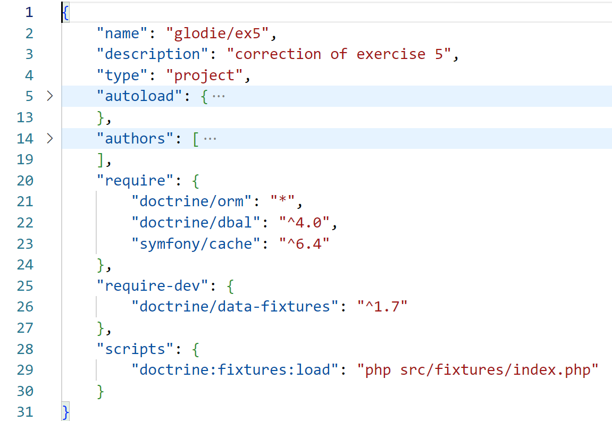

# Exercice 2 

## Enoncé

1. Créez un nouveau projet avec composer (utilisation de la commande `composer init`, attention soyez vigilant à l'endroit (dossier) ou vous allez exécuter cette commande, vous devez être à la racine de votre projet).
2. Installez les dépendances ci-dessous en respectant les environnements mentionnées.
3. Dans le composer.json, ajoutez une clé nommée *scripts* et créez un script qui contient l'instruction `echo 'hello world'`. Lorsque ce script sera appelée depuis la console (terminal) via la commande `composer run nomDeCleAssocieAMonScript`, le message `hello world` sera affiché dans la console.
4. Exécutez le script pour obtenir 'hello world' depuis la console.

## Dépendances globales cad sur tous les environnements (prod et dev)

- monolog/monolog
- psr/cache
- vlucas/phpdotenv
- twig/twig
- symfony/mailer

## Dépendances en développement (uniquement en dev)

- phpunit
- phpunit/php-code-coverage
- mikey179/vfsstream
- fakerphp/faker

---

## Exemple fichier composer

