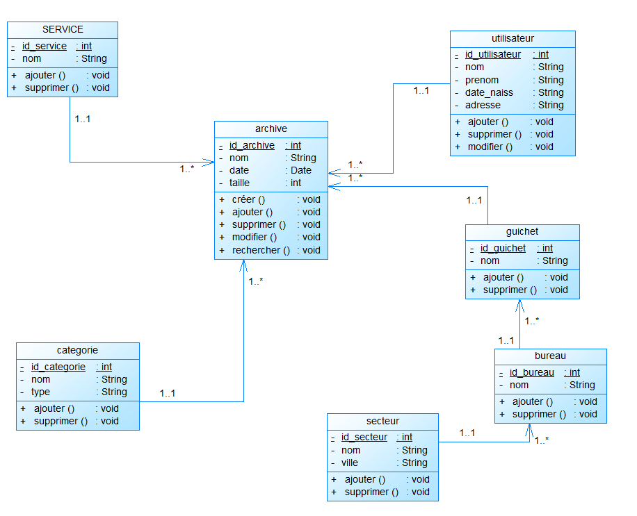

# Exercice 3 : espace de nom

1. Récupérez le [zip suivant](./ressources/ex3.zip)
2. Refactorisez le projet en y ajoutant des espaces de noms et en respectant la norme [PSR-4](https://www.php-fig.org/psr/psr-4/)
3. Créez un script qui instancie 2 à 3 objets de votre choix.

## Schéma UML des classes à refactoriser

[Source diagramme de classe de developpez.net](https://www.developpez.net/forums/d1878825/general-developpement/alm/modelisation/uml/diagramme-classe-base-donnees/)

