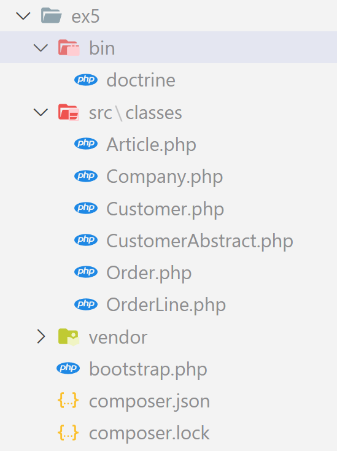

# Exercice 5 : Doctrine

---

## Ressources

- [Les types Doctrine](https://www.doctrine-project.org/projects/doctrine-dbal/en/4.0/reference/types.html)
- [Les annotations Doctrine](https://www.doctrine-project.org/projects/doctrine-orm/en/2.7/reference/annotations-reference.html)
- [Gestion de l'héritage, documentation à lire, arrêtez-vous avant le chapitre sur les Overrides](https://www.doctrine-project.org/projects/doctrine-orm/en/3.1/reference/inheritance-mapping.html)

---

## Aide mise en place

1. Vous devez au préalable initialiser un nouveau projet avec `composer` et installer les packages `doctrine/orm` et `symfony/cache`
2. Copiez/collez vos classes de l'exercice 1 dans le nouveau dossier `src`
3. Récupérez les fichiers `bootstrap.php` et `bin/doctrine` depuis [les ressources](./ressources/doctrine-config/) à placer à la racine du projet.
4. Créez une base de données depuis PHPMYADMIN
5. Modifiez les informations d'accès à votre base de données depuis le fichier `bootstrap.php`
6. La commande pour voir la liste des commandes Doctrine disponibles est `php bin/doctrine list`

---

## Enoncé

1. Mettez en place vos namespaces.
Pensez à chaque fois à exécuter la commande `composer dump-autoload` pour mettre à jour votre autoloader (vendor/autoload.php) après chaque modification du fichier composer.php dans la partie autoload PSR-4.
2. A partir du diagramme de classes UML ci-dessous et de vos classes PHP de l'exercice 1, utilisez les annotations Doctrine sur les propriétés de vos classes PHP et commandes Doctrine pour créer les tables dans votre base de données.

### Exemple de l'arborescence finale

---

## Diagramme de classe

[Source diagramme de classe manurmx](https://medium.com/@manurnx/le-diagramme-de-classes-2447602613f2)

