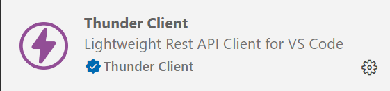
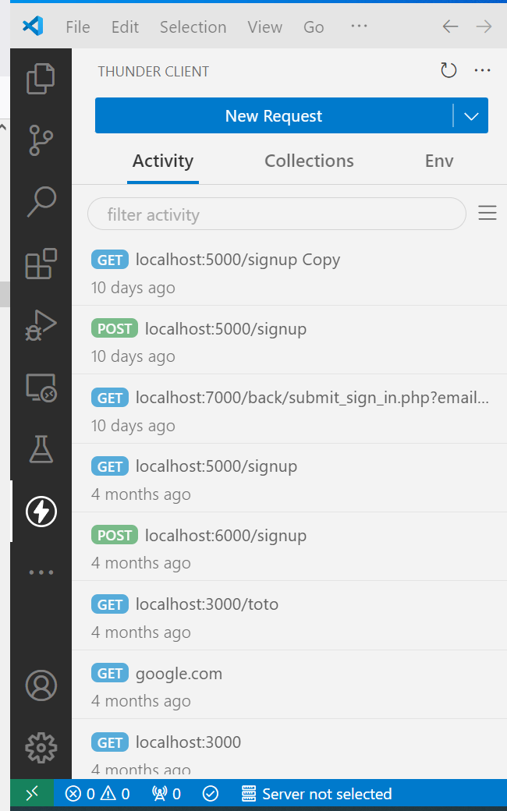
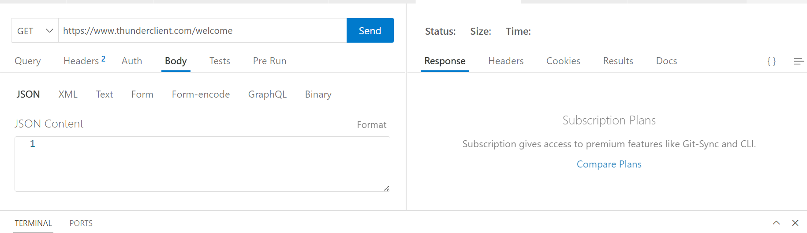

# Exercice 6 : Doctrine EntityManager

1. Insérez les articles, clients et des commandes.
Pour cela, côté front, utilisez l'extension ***Thunder Client*** pour envoyer des données au serveur sans passer par un formulaire.
2. Récupérez depuis Doctrine par l'intermédiaire de l'Entity Manager les informations depuis la base de données et affichez les.

## Extension thunder client

---

---

