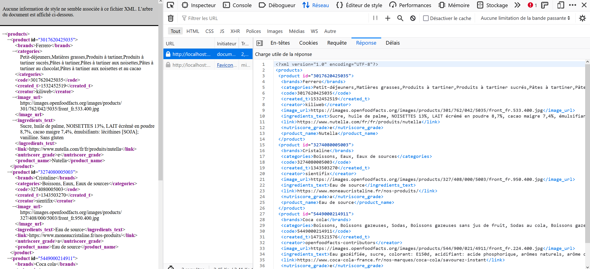
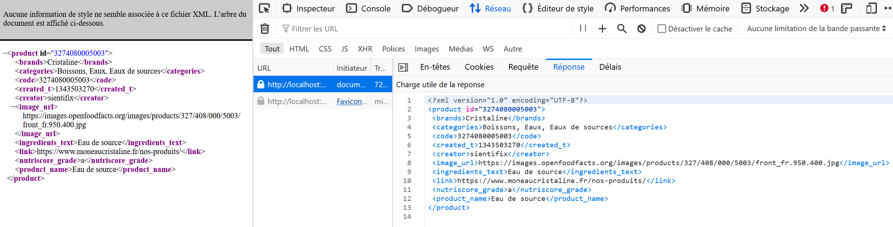

# Exercice 7 : XML

---

## Enoncé

1. Initialisez un nouveau projet avec composer.
2. Créez un document XML qui répond aux exigences suivantes : 
- Fournissez toutes les informations ci-dessous sur X produits de votre choix depuis l'API OpenFoodFact en XML.
- Fournissez toutes les informations ci-dessous d'un produit à partir de son identifiant en XML

---

## Aide pour l'utilisation API d'openfoodfacts

Pour réaliser cet exercice, utilisez l'URL [https://fr.openfoodfacts.org/api/v0/produit/{id}.json](https://fr.openfoodfacts.org) en remplaçant {id} par le code du produit. Par exemple [https://fr.openfoodfacts.org/api/v0/produit/26051697/](https://fr.openfoodfacts.org/api/v0/produit/26051697/). Les informations sont récupérées en JSON.

---

## Informations à retourner en français ainsi que les clés associées entre les parenthèses

- Code (*code*)
- Marque (*brand*)
- Catégories (*categories*)
- Créateur (*creator*)
- Date de création (*created_at*)
- Lien vers une photo du produit (*image_url*)
- ingrédients (*ingredients*)
- Matériel pour le packaging (*packaging_materials*)
- Le score nutriscore (*nutriscore_grade*)
- Nom du produit (*product_name*)

---

## Exemples du résultat attendu

### Plusieurs produits

### Un produit

