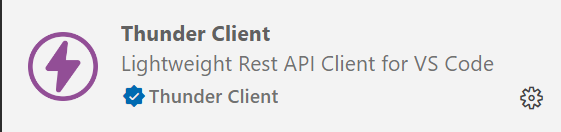

# Exercice 9 : créer sa propre API REST

## Fonctions et instructions dont vous aurez besoin

- [json_decode()](https://www.php.net/manual/en/function.json-decode.php)
- [json_encode()](https://www.php.net/manual/en/function.json-encode)
- `json_decode(file_get_contents("php://input"))`: pour récupérer les données envoyées en JSON depuis le client Thunder Client sous forme de tableau ou d'objet stdclass cf. la documentation de la fonction *json_decode()*, ci-dessus.

## Enoncé

1. Créez une API REST qui répond aux exigences ci-après

## Exigences

- **Les informations doivent-être envoyés et récupérées en JSON**
1. Répondez avec quelques informations sur tous les articles à partir d'une requête cliente avec la méthode HTTP GET
2. Répondez avec quelques informations sur un article à partir de la méthode HTTP GET et du code de l'article fournit par la requête client
3. Créez un nouvel article en fournissant à votre API via la méthode HTTP POST des informations sur l'article en JSON

## Bonus

4. Supprimez un article à partir de son ID et de la méthode HTTP DELETE
5. Modifiez un article à partir de son ID et des nouvelles informations envoyées depuis le client en JSON et via la méthode HTTP PUT.

---

## Aide et méthodologie

- Réfléchissez aux routes (endpoints)
- Développez en POO
- Revoyez les étapes pour la construction d'une API depuis le cours
- Pour tester votre API, utilisez l'extension *Thunder Client* (pas besoin de mettre en place de formulaire, envoyez vos requêtes directement depuis l'extension Thunder Client)
- Vous pouvez passer vos paramètres dans l'url via les paramètres par exemple `http://localhost/ex9/articles?id=10`

### Extension Thunder Client

<!-- - Vous devez lancer votre application via *Xdebug* ou via *la console*.
Pour la console, il faut exécuter la commande depuis la racine de votre projet en indiquant dans le chemin à partir de la racine le fichier à lancer.
Par exemple pour la commande `php -S localhost:9000 src/index.php`, cela signifie que l'application tourne sur le port 9000 et lorsqu'un client se rendra à cette adresse `http://localhost:9000`, alors il verra le résultat de l'exécution du script (fichier php) `src/index.php`. -->

Pour interroger votre application depuis l'extension ci-dessous, il suffit de créer une nouvelle requête en renseignant l'adresse de votre application, par exemple, `http://localhost/ex9`. Dans le cas ou, thunder client vous répond connexion refusé, veuillez remplacer `localhost` par `[::1]` donc `http://[::1]/ex9`. `[::1]` est l'adresse de localhost en [IPV6](https://fr.wikipedia.org/wiki/Adresse_IPv6)

#### Extension thunder client

Extension à télécharger

---

Création d'une nouvelle requête

---

Exemple d'une requête *GET* vers l'API avec la réponse de l'API.

---

Exemple d'une requête *POST* en fournissant les données en JSON depuis l'onglet *Body* de *Thunder Client*.

Pour récupérer ces données côté PHP vous devez utiliser l'instruction suivante : ***`json_decode(file_get_contents("php://input"));`***.
En effet, malgré le fait que vous envoyez les données en *POST*, la superglobale *$_POST* sera vide car vous n'êtes pas dans le contexte d'un formulaire HTML.

