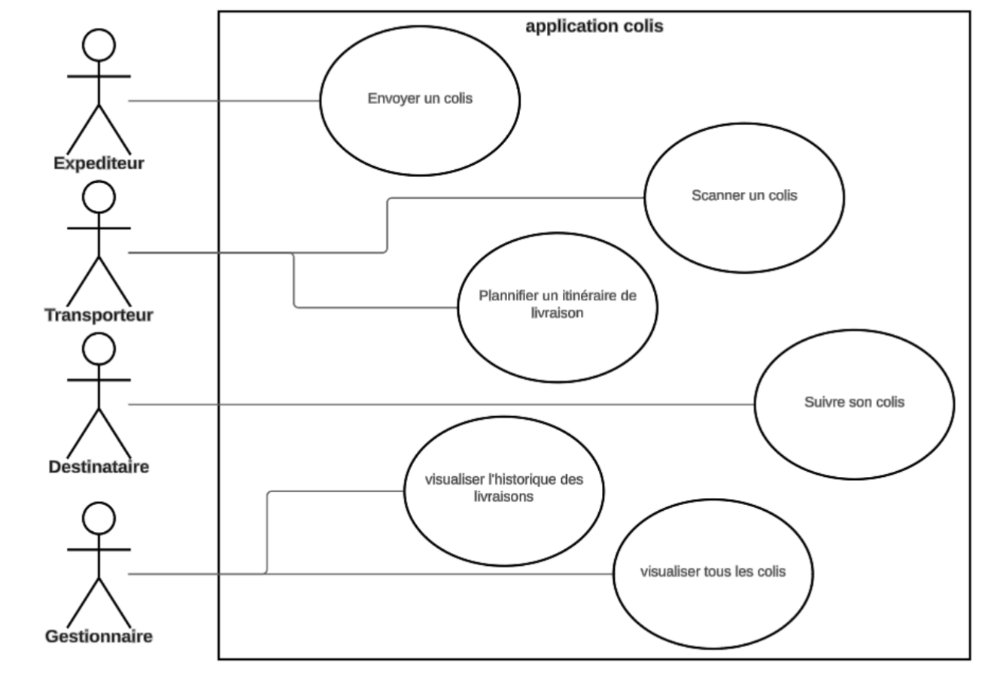

# Exercice 2 : méthodes magiques et abstraites

1. Reprenez les classes de l'exercice 1 intro en intégrant des méthodes magiques, des classes abstraites et des interfaces lorsque c'est possible et que c'est pertinent.
2. Implémentez dans le code quelques cas d'utilisation en vous appuyant sur votre diagramme de cas d'utilisation.

