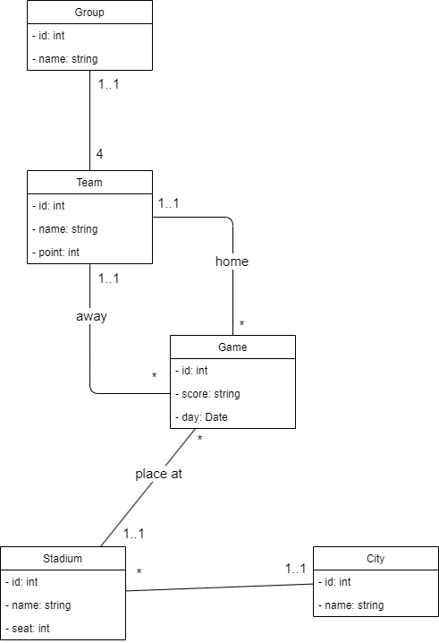
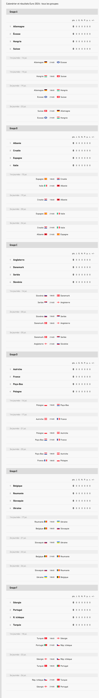

# TP euro 2024 en binôme

---

## Spécifications techniques

- Séparer les classes dans un dossier spécifiques
- Séparer la ou les parties visuelles dans un autre dossier

---

## PARTIE 0 : POO

### Jour 1 : création des classes

1. A partir du diagramme de classes ci-dessous, créez les classes en PHP.
2. Réalisez les scénarios de cas d'utilisation suivantes :
- Tous les matchs du Groupe A, avec les scores pour chaque match et les stades (cf. le calendrier des matchs dans les screens ci-dessous).

## Jour 2 : ajout de composer et des namespaces

1. Initialisez un projet *composer*
2. Mettez en place les *namespaces* 
<!-- 3. Bonus : Générez de manière aléatoire les scores (tout en restant réaliste pas de "147-0" lol) et Affichez le classement du groupe A en fonction des résultats des matchs -->

### Diagramme de classe

---

## PARTIE I : Doctrine

1. A partir du diagramme de classes ci-dessous et des annotations et commandes Doctrine, créez la base de données et les tables associées. **ATTENTION group est un mot reservé par SQL, il faut renommer la table à l'aide des annotations de Doctrine**
2. Insérez les équipes et les groupes depuis les photos des poules de l'euro 2024 ci-dessous

## Données à inserer (répartition des équipes dans les groupes)

[Source image equipe.fr](https://www.lequipe.fr/Football/euro/page-calendrier-resultats)

---

## PARTIE II : refactorisation du code en architecture MVC

1. Refactorisez (modifier le code sans changer son comportement (ajouter des nouvelles fonctionnalités)) en créant des contrôleurs, models et vues.

---

## PARTIE III : Web service

1. Transformez votre programme en web service

